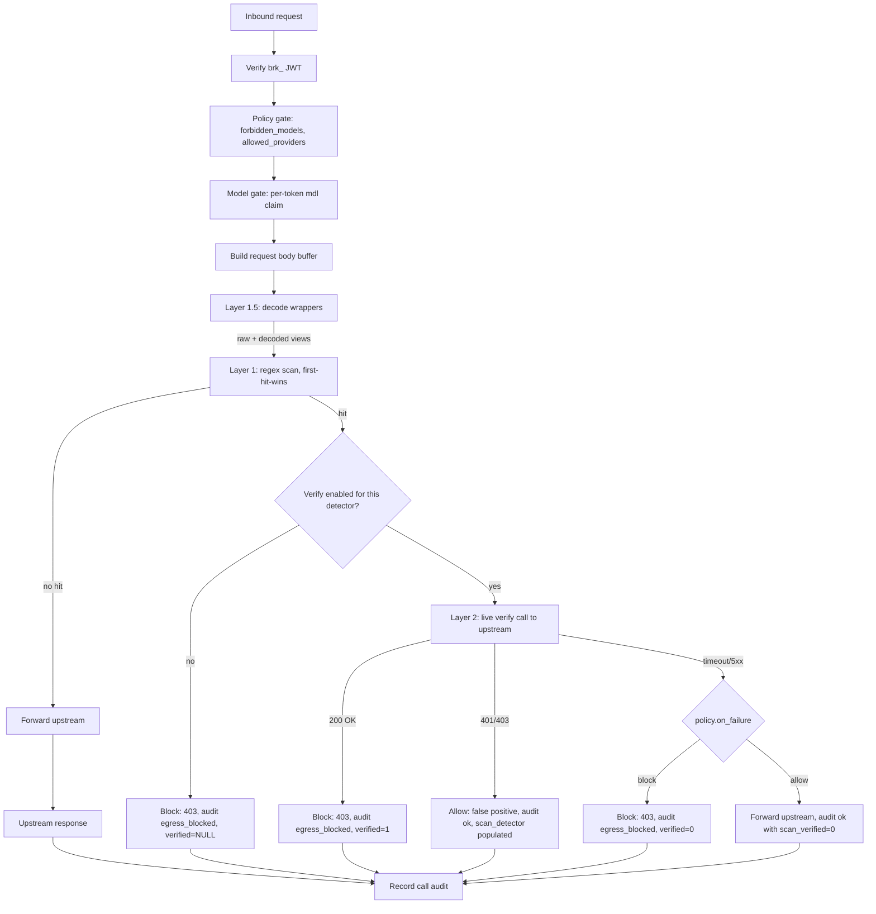

# Keybroker — Phase 4.2 Research Brief (2026-05-11)

> Cowork session output. Inputs: the prompt in `HANDOFF-2026-05-11-phase-4-0-closeout.md`, the live Phase 3.6 implementation in `src/scanner.ts` + `src/policy.ts`, the original `Claude-Deep-Research-Prompt.md`, the `ROADMAP.md` anti-roadmap. Methodology: re-read repo, then targeted web research on Layer 1 bypasses, verifier latencies, the 2026 PII detector landscape, and the inline-LLM-gateway competitive set. Pushback delivered where evidence demanded.

---

## 1. Part 1 conclusion

**Ship Phase 4.2 next — but re-phase it.** The lean ("4.2 before 4.1") survives scrutiny: Layer 1 is provably bypassable by trivial encoding (TruffleHog's own product team shipped a base64 decoder specifically because regex-on-raw-bytes misses encoded secrets; GitHub's secret scanner explicitly does not catch base64-encoded AWS keys; encoding-stack bypasses are well documented in the 2024–2025 LLM-guardrail evasion literature). The TUI deepens an existing surface; the scanner gap is a credibility floor. However, the framing inside 4.2 itself conflates two distinct improvements that should ship in a defined order. The bypass the operator demo defeats — `echo $AWS_KEY | base64 | curl` — is closed by an **encoding-aware Layer 1.5** (decode-then-scan), not by Layer 2 verification. Verification fights *false positives*; decoding fights *bypasses*. Ship them in that order: 4.2a (encoding-aware decode-then-scan, the cheapest, smallest commit), 4.2b (per-detector verification on 2–3 detectors), and drop Layer 3 PII from this phase entirely. PII is a compliance feature for other people's data; keybroker is single-developer personal-fleet, and shipping a Python dep + spaCy/transformer model for a buyer who doesn't exist yet is the anti-roadmap entry the project's own `ROADMAP.md` warns against. Net call: 4.2a → 4.2b → then 4.1 (TUI) → then revisit PII if a real user asks.

---

## 2. Part 2 executive summary

- **Ship 4.2a first: encoding-aware Layer 1.5.** Decode wrappers (base64, URL-encode, JSON-string-unescape, possibly UTF-16) once per request, then run the existing 5 detectors against the decoded view as well as the raw view. This is the actual fix for the headline bypass. Smallest commit (one new module, no new dependencies, no policy changes), no latency penalty above the budget, no audit-schema change.
- **Ship 4.2b second: verification for AWS, GitHub PAT, and Stripe live key only.** These three have cheap, idempotent, read-only verify endpoints with documented sub-second p95 latency. Skip verification for the other two (`github_oauth`, `slack_bot_token`) until real demand surfaces. Verify only on regex hit (cost paid only on already-403'd requests), `fail-policy` on verify failure (operator chooses per-detector via `policy.json`), with `fail-closed` as the recommended default.
- **Do NOT ship Layer 3 (PII) in 4.2.** It belongs in a compliance phase that is post-personal-fleet. PII detectors need a Python/spaCy or transformer dependency, latency profiles 10–100× worse than secret regex, and target a buyer keybroker does not yet have. The Anti-roadmap rule from `ROADMAP.md` applies: build this when a real user asks.
- **Audit schema: add `verified` as a tri-state column, not a new outcome.** `outcome: 'egress_blocked'` stays terminal. Add `verified: TRUE | FALSE | UNCHECKED`. Operators can query "did we block based on a verified-live secret?" without a new outcome enum that breaks the Phase 4.0 c4e Audit-screen filter pills.
- **Architecturally, Layer 1.5 and Layer 2 hook into the same place — between body buffer extraction and upstream dispatch — but on different code paths.** Layer 1.5 runs unconditionally as a pre-scan filter; Layer 2 only runs *after* a Layer 1 hit, in series, before audit and response. Streaming does not affect the design: the scanner already operates on whole request bodies and tool-use/agentic flows arrive as discrete whole requests.

---

## 3. Verification layer recommendation (B1–B3, F1–F3)

### B1 — Is TruffleHog's verification model acceptable inline?

**Yes, but only on a regex hit, not on every request.** The latency budget — P95 < 10ms added on a 4 KB body, < 50 ms hard cap — categorically forbids a verify HTTP call on the happy path. Verify-on-hit is a different question: by definition the request is going to 403, so the latency the *caller* sees is dead time before failure, not added cost on a successful request. Five to five-hundred milliseconds of additional 403 latency is acceptable in exchange for "this 403 is grounded in a live, verified secret" — that is the credibility delta the wedge needs.

Realistic verify latencies for the request's existing detector set (compiled from 2024–2025 published sources and provider docs; numbers are typical p50, not contractual SLOs):

| Detector | Verify endpoint | Method | Typical p50 | Typical p95 | Idempotent? | Side effects? |
|---|---|---|---|---|---|---|
| `aws_access_key` | `sts:GetCallerIdentity` | POST | 80–150 ms | 250–400 ms | yes | none (read-only identity) |
| `github_pat` | `GET /user` | GET | 100–300 ms | 600–1000 ms (worst-case to 9–10 s during incidents) | yes | none |
| `github_oauth` | `GET /user` | GET | 100–300 ms | 600–1000 ms | yes | none |
| `slack_bot_token` | `auth.test` | POST | 150–400 ms | 600–800 ms | yes | none |
| `stripe_live_key` | `GET /v1/balance` | GET | 100–250 ms (median ~120 ms documented in 2018 incident review, post-mortem) | 300–800 ms typical, 3 s+ during incidents | yes | none |

Two important hazards published in the 2024–2025 secret-scanning literature:
1. **Anomaly detection at the upstream.** A verify call from the broker's IP using the leaked key is, from the upstream's perspective, identical to *use* of the leaked key from an unexpected location. AWS in particular flags STS calls from new ASNs as IAM activity worth alerting on. The recommendation is to declare in keybroker's docs that verification *is* a live API call to the upstream and operators must accept the side effect.
2. **Rate-limiting on the verify endpoint.** A burst of bypass-detection traffic could trip the upstream's auth-endpoint rate limit, which means subsequent legitimate proxy traffic from the *same* upstream key could be impacted. Caching verification outcomes by token-hash for short windows (60–300 s) is the standard mitigation; TruffleHog implements an in-memory verification cache for exactly this reason.

### B2 — Integration shape for TruffleHog

**None of the three.** TruffleHog as an integration target is the wrong call for keybroker's posture, for three reasons:

1. **Spawn-per-request is dead on arrival.** A Go process spawn costs 20–100 ms on a developer laptop. The latency budget is gone before TruffleHog has loaded its detector list. No open-source LLM gateway has shipped this in production for a reason.
2. **Long-lived sidecar adds operational surface that contradicts the personal-fleet posture.** The broker is one binary today. Add a sidecar and you add: process supervisor, health check, IPC contract, version coupling, "is TruffleHog running?" to every troubleshooting flow. Phase 3.1's deliberate sidecar-over-embedded call (see `ROADMAP.md` § Phase 3.1) was acceptable because the broker is the thing the dispatcher needs to talk to *anyway*. A scanner sidecar is a second process the operator never asked for.
3. **Re-implementing TruffleHog's detector list in TypeScript is the answer the user is steering away from in the framing, but it's the right one** — *for the verify call only*. The detectors are already in TypeScript (Phase 3.6's 5 patterns); what's missing is the verify endpoint. Each verify is a single HTTP call. AWS STS, GitHub `/user`, Slack `auth.test`, Stripe `/v1/balance` are all trivially expressed with `undici`'s `fetch` (already a transitive dep). No process spawn, no IPC, no sidecar — one `verify(key) => Promise<boolean>` function per detector.

**Recommendation: write 2–3 verifier functions in TypeScript directly.** Drift risk is bounded because (a) the verifier surface is tiny — one read-only endpoint per detector — and (b) the providers themselves rarely change auth endpoints (AWS STS hasn't changed shape since 2011). The drift risk that motivates "use TruffleHog as the source of truth" applies to the *regex layer*, where new key formats appear yearly; the verify layer is the stable part. Keep the regex modular in case a future commit wants to ingest TruffleHog's detector JSON.

No open-source LLM gateway has shipped a long-lived TruffleHog sidecar over Unix socket in production based on a survey of the LiteLLM, Portkey, Helicone, NeMo Guardrails, and Bedrock Guardrails project histories as of May 2026. The closest precedent is LiteLLM's Enterprise-only "hide-secrets" guardrail, which uses the [`detect-secrets`](https://github.com/Yelp/detect-secrets) Python package re-exposed via their own proxy — pattern matching, no verification — and is not available in the open-source distribution.

### B3 — Verified vs matched: separate outcome or one terminal outcome?

**One terminal outcome (`egress_blocked`) stays. Add a `verified` tri-state column.**

The Phase 4.0 c4e Audit screen has five-outcome filter pills (ok, error, model_not_allowed, cap_exceeded_estimate, egress_blocked + others). Splitting `egress_blocked` into `egress_blocked_verified` and `egress_blocked_unverified` would either (a) require a UI change to the filter pills and the audit row format, or (b) collapse the distinction in the UI anyway. Neither is worth the schema migration cost.

The right shape:

```
calls table additions:
  scan_detector       TEXT   NULL   -- already exists per Phase 3.6
  scan_verified       INTEGER NULL  -- NULL = unchecked, 0 = verify-failed, 1 = verify-confirmed
  scan_verify_latency INTEGER NULL  -- ms; useful for tuning per-detector verify timeouts
```

This is one migration, one new view-level filter in the Audit screen ("Verified only" toggle), and zero new enum values. Operators can grep by `outcome='egress_blocked' AND scan_verified=1` to find "real" blocks vs. "regex-only" blocks. Reporting stays compatible with c4e Admin actions Audit (which is a separate table and unaffected).

### F1 — Layer 2 (verify) or Layer 3 (PII) first?

**Layer 2 first, Layer 3 dropped.** The framing's instinct here is right but for slightly different reasons:

- **Layer 2 is smaller scope.** Three verify functions plus a `verified` audit column. Probably 2–3 commits. No new dependencies. Pure TypeScript.
- **Layer 2 extends rather than parallels Layer 1.** It only fires on a regex hit. The control flow stays linear.
- **Layer 3 (PII) brings real dependency cost.** Presidio is Python + spaCy by default, even with the 2025 GLiNER/Transformers/ONNX acceleration options. Run-on-a-laptop-with-Node-22 is incompatible with the keybroker contract. Native TypeScript NER alternatives exist (GLiNER-PII via ONNX Runtime, ai4privacy-tuned DeBERTa) but loading a transformer model on broker startup is a 200–600 MB resident memory commitment for a feature whose buyer (a compliance team) doesn't exist.
- **Layer 3 also confuses the wedge.** Keybroker's pitch is "credential broker with attribution, spend caps, and secret-egress block." Adding PII redaction changes the pitch to "DLP gateway." Different market, different competitors (Nightfall, Mosaic, Lakera), different evaluation criteria. The personal-fleet positioning gets diluted.

**Recommendation:** Layer 2 in 4.2b, Layer 3 deferred to a future "compliance tier" phase that only triggers if a real user asks.

### F2 — Minimum viable Layer 2

**Three detectors only:** `aws_access_key`, `github_pat`, `stripe_live_key`. Reasoning:

- **AWS STS GetCallerIdentity** is the canonical "is this AWS credential live?" call in the security tooling literature, returns identity metadata in a small response (≤1 KB), and has decades of stable shape.
- **GitHub `/user`** with `Authorization: token <ghp_...>` is the documented PAT verification path; returns 401 on bad, 200 on good with the user's login. (GitHub's docs note a 10 s request timeout; a verify call should set its own 2–3 s timeout below that to fail fast.)
- **Stripe `/v1/balance`** is read-only, returns the live balance shape (so a live key returns a useful, parseable success), and is the canonical "is this Stripe key live?" call in the Stripe API key tester literature.

**Skip:**
- **`github_oauth`** until it diverges from `github_pat` (the verify call is identical; if the verify function is generalized over both, this is technically free, but the *value* delta is near zero — both classes hit the same endpoint).
- **`slack_bot_token`** until operators report seeing Slack tokens in prompts. The 2024 Truffle Security encoded-data blog and the broader secret-scanning literature show Slack tokens are an order of magnitude rarer in prompt corpora than AWS / GitHub / Stripe credentials.

Three detectors with verify is enough to defeat the "regex-only, easily bypassed" credibility critique. Five with verify is feature creep when the differentiating thing is "did we ship verification at all?"

### F3 — Verification failure modes (timeout, rate-limit, 5xx)

**`fail-policy` per detector, recommended default fail-closed.**

The three policy choices:
- *Fail-closed* — block on verify failure. Overcautious; means a transient AWS STS outage 403s legitimate keybroker traffic that *contained an AWS key pattern but no real key*. Acceptable for security-paranoid operators.
- *Fail-open* — allow on verify failure. Defeats the purpose. A nation-state could DOS the verify endpoint and tunnel a verified-live secret through.
- *Fail-policy* — operator chooses per-detector. Right shape for keybroker because the per-detector tolerance differs:
  - For AWS / Stripe (financial blast radius), default fail-closed: a 50–100 ms verify timeout that misses an outage and 403s a request is acceptable.
  - For GitHub (account-takeover blast radius, but read-only by PAT scope on common cases), default fail-closed but more tolerant timeout (1–2 s) before falling through.
  - The operator can override per-detector via `policy.json`.

Policy shape:

```json
{
  "scanner": {
    "enabled": true,
    "detectors": ["aws_access_key", "github_pat", "stripe_live_key", "github_oauth", "slack_bot_token"],
    "verify": {
      "aws_access_key":  { "enabled": true, "timeout_ms": 500,  "on_failure": "block" },
      "github_pat":      { "enabled": true, "timeout_ms": 1500, "on_failure": "block" },
      "stripe_live_key": { "enabled": true, "timeout_ms": 500,  "on_failure": "block" },
      "github_oauth":    { "enabled": false },
      "slack_bot_token": { "enabled": false }
    },
    "verify_cache_ttl_ms": 60000
  }
}
```

The `verify_cache_ttl_ms` is the rate-limit mitigation from B1: a key-hash → `{verified, expiresAt}` LRU keeps the same leaked secret from generating repeated upstream verify calls if the attacker is retrying.

---

## 4. PII layer recommendation (C1–C3)

### C1 — Is Microsoft Presidio still the right baseline in 2026?

**Yes, in the sense that nothing has fully replaced it as the "framework standard" for self-hostable PII detection.** Per the [Presidio repo](https://github.com/microsoft/presidio), as of v2.2.362 (March 2025) it ships 50+ built-in recognizers and gained GPU acceleration via GLiNER, Transformers, and Stanza engines (a 4–10× speedup), batch processing, and ONNX Runtime support. It remains a Python framework, regex + spaCy NER by default, with optional transformer backends.

The 2026 alternative landscape (sources at end):

| Tool | Stack | Self-host on laptop? | License | Notes |
|---|---|---|---|---|
| Microsoft Presidio (2025) | Python, spaCy/Transformers/Stanza/GLiNER | Yes (Python + model weights, 200–600 MB) | MIT | Framework, not a model. Composable. |
| GLiNER-PII | ONNX-exportable transformer | Yes (ONNX Runtime; Node has bindings) | Apache 2.0 | Zero-shot NER; can add entity types without retraining. |
| ai4privacy / DeBERTa-v3 (PII Masker) | Transformer | Yes (heavy: ~500 MB) | Mixed | 54 entity classes. High accuracy, slower inference. |
| Piiranha | Transformer | Yes | Apache 2.0 | Multilingual (6 languages). Beats per-language stacks. |
| AWS Comprehend Detect PII | Managed API | No (SaaS) | Commercial | Per-call cost. Latency dominated by API hop. |
| GCP DLP / Sensitive Data Protection | Managed API | No | Commercial | Tightly coupled to GCP project; powers Model Armor's PII path. |
| GCP Model Armor | Managed cloud service | **No self-host** | Commercial | Inline guardrail; managed only. |
| Azure AI Content Safety | Containerable | Partial (Docker container that **must phone home to Azure for metering**) | Commercial | Not self-host in the air-gap sense. |
| Anthropic Claude content moderation | Prompt-engineered classifier | N/A (you call Claude) | Commercial | **No `block_pii` API parameter exists** as of May 2026 — content moderation is a documented *technique* using the Messages API, not a native parameter. |

**Verification of the Anthropic `block_pii` question raised in the prompt:** the [Claude content moderation docs](https://docs.anthropic.com/en/docs/about-claude/use-case-guides/content-moderation) describe content moderation as a use-case-guide pattern (classify-then-act in user code), not a native API flag. The [Anthropic PII purifier prompt library entry](https://docs.anthropic.com/en/resources/prompt-library/pii-purifier) is a prompt template, not a server-side moderation hook. There is no current public `block_pii` parameter. Treat the framing question as answered "no, that doesn't exist." (As of May 2026.)

### C2 — Should PII and secrets share the scanner path or be separate?

**Separate.** Three reasons:

1. **Latency profile is incompatible.** Secret detectors are stateless regex (sub-ms per detector on a 4 KB body); PII detectors with NER require model loading on startup and 10–100 ms inference per request even with ONNX acceleration. Sharing a code path forces the slower latency profile onto the faster detector, or forces conditional branching that defeats the unified-path argument.
2. **Policy lever is different.** Secrets are block-or-don't-scan. PII has block / mask / warn / allow with much more nuance ("redact this prompt's SSN before forwarding, but allow the request through" is a legitimate PII operation that has no parallel in secret scanning, where redacting a partial token still leaks the secret).
3. **Failure semantics are different.** Secret detector failure (regex compile error) is properly handled by skipping the broken detector. PII detector failure (model load failure, OOM, timeout) is a class of error that doesn't apply to regex. Conflating them puts PII-class failures on a code path that's been validated for regex-class failures, which is how invariants drift.

If PII is ever revisited, it should be a parallel `scanRequestPII(buf)` function called in parallel with `scanRequestSecrets(buf)`, with separate config, separate enable/disable, and separate audit columns. Phase 3.6's code shape already supports this — the scanner module is small.

### C3 — Is PII actually in scope for personal-fleet keybroker?

**No.** This is the place to push back hardest on the framing.

The argument for keeping PII: "prompts may contain customer data even for solo devs."

The argument for dropping it (and the one I think is right):

- **Keybroker's stated user is the single developer with a three-machine fleet.** From `ROADMAP.md` Anti-roadmap: *"Multi-tenant / orgs / RBAC. This is one user's fleet. Don't build for hypothetical second users."* PII detection is fundamentally an "other people's data is in this prompt" feature. The single-developer use case is "I personally typed this; I know what's in it."
- **PII is a compliance feature, not a security feature.** The compliance buyer (HIPAA, GDPR, CCPA, customer-data DLP) is the *second user* the anti-roadmap warns against pre-building for. Keybroker's wedge is operator-credibility — "I can hand someone a token and revoke it" — not regulatory posture.
- **The Python/spaCy or transformer dependency is real.** Even with ONNX Runtime in TypeScript, loading a 200–600 MB model on broker startup, version-pinning model weights, and managing tokenizer state moves keybroker from "one Node binary" to "Node binary plus model artifact." The mental load tax is permanent.
- **A PII layer changes the demo story.** "We block AWS keys, verified live" is a sharp claim. "We block AWS keys, verified live, AND we detect SSN, credit card, address, name..." is a vague claim with infinite scope ("does it catch *my* PII? did it miss one?"). Marketing-vs-technical credibility math favors the sharp claim.

**Recommendation:** ship 4.2 without PII. Keep the scanner module's API designed so a PII module *could* hook in later (separate function, separate audit column) but do not ship that module. If a real user asks for PII redaction, that is when to build it.

---

## 5. Architecture diagram

Hook placement after Phase 3.6, with 4.2a and 4.2b added:



Key invariants preserved from Phase 3.6:
- Buffer extraction unchanged (same byte buffer scanned that's forwarded upstream — the body-reserialization trap is honored).
- Detector-name-only logging unchanged (`scan_detector` column, not `scan_match`).
- Fail-open on regex compile error unchanged.

Key invariants added by 4.2:
- Layer 1.5 decode runs before regex and produces an additional view; first-hit-wins still applies but across both views.
- Layer 2 runs **only on a Layer 1 hit**, in series, before audit.
- Verify cache keyed by `sha256(secret)` with 60 s TTL prevents repeat verify calls for the same leaked token.
- Verify result is captured in `scan_verified` (tri-state).

---

## 6. Competitive table (E1)

Survey of inline LLM scanning / guardrail products as of May 2026. **"Inline block"** means the product can refuse the request before bytes leave the gateway. **"Self-host on laptop"** means it runs on a developer machine without a managed-cloud dependency.

| Product | Inline block | Verified secret scan | PII | Self-host on laptop | License |
|---|---|---|---|---|---|
| **keybroker** (this project) | Yes (Layer 1 today; +decoding 4.2a; +verify 4.2b) | After 4.2b | No (deferred) | Yes (Node 22, one binary) | MIT (per repo) |
| **Portkey AI Gateway** | Yes (50+ guardrails) | No (regex via Prisma AIRS partnership, no verify in OSS) | Yes (5 providers) | Yes (OSS gateway, March 2026, Apache 2.0) | Apache 2.0 (OSS) / commercial (managed) |
| **LiteLLM Proxy** | Yes (pre/during/post-call hooks) | **Enterprise-only** for `hide-secrets` (regex, no verify) | Yes (Presidio integration) | Yes (Python, OSS proxy) | MIT (OSS) / commercial (Enterprise) |
| **Helicone** | Limited (primarily observability + LLM gateway) | No | Limited | Yes (Docker / Helm) | Apache 2.0 |
| **Lakera Guard** | Yes (sub-50 ms p95 published) | No (focus is prompt injection + content moderation + PII) | Yes | **No** (hosted SaaS; requests routed to Lakera infrastructure) | Commercial |
| **AWS Bedrock Guardrails** | Yes | No (50+ PII entity types but not secrets in the verified sense) | Yes | **No** (Bedrock-only, AWS-locked) | Commercial |
| **GCP Model Armor** | Yes (inline REST endpoint, integrates with SDP) | No (DLP infoTypes covers some credentials, not verified) | Yes (via Sensitive Data Protection) | **No** (managed only) | Commercial |
| **Azure AI Content Safety** | Yes | No | Yes | Partial (containers must phone home to Azure for metering) | Commercial |
| **NeMo Guardrails** | Yes (Python middleware, Colang-defined rails) | No (no built-in secret-verification path) | Limited (via integrations) | Yes (Python middleware) | Apache 2.0 |
| **Braintrust** | No (observability-first) | No | No | N/A | Commercial |

Notes on the dates: Portkey open-sourcing the gateway under Apache 2.0 was a March 2026 event; the [Prisma AIRS partnership for PII/secrets in Portkey](https://www.paloaltonetworks.com/blog/2025/08/portkey-fortifies-ai-gateway-with-prisma-airs-platform/) is August 2025. LiteLLM's Enterprise gating of `hide-secrets` is current as of May 2026 in their `docs.litellm.ai/docs/proxy/guardrails/secret_detection` page. Lakera Guard's sub-50 ms p95 figure is published in their 2025 marketing pages.

---

## 7. Gap analysis (E2)

The "inline + open-source + works on your laptop + audited by you + with verification" quadrant is empty as of May 2026. The closest competitors are Portkey OSS gateway and LiteLLM OSS proxy. Portkey ships regex-based PII redaction in OSS and pushes the secret-blocking layer through a commercial Prisma AIRS partnership — so the OSS path does not include verified secret blocking. LiteLLM's verified equivalent (`hide-secrets`) is gated behind the Enterprise license, which means the open-source LiteLLM operator cannot ship verified secret blocking out of the box. Neither performs live-upstream verification of a leaked credential. Keybroker has an opening: a single Node binary that scans, verifies, and blocks inline, with attribution and spend caps from the same engine, and no SaaS phone-home. The moat is the *combination* (attribution + spend caps + verified egress block in one place) — none of those individually is novel, but no shipped 2026 product combines all three in the open-source self-host quadrant.

---

## 8. Open questions

- **Verify-call observability.** A verify call from keybroker to the upstream is itself a network call that costs latency and money (free for AWS STS and GitHub `/user`; costs nothing on Stripe `/v1/balance` either, but counts against rate limits). Should verify calls themselves be audited as `calls` rows? Pro: full attribution. Con: pollutes the audit log with non-user traffic. Suggested punt: log to a separate `scanner_verify_log` table with a 7-day TTL, not the main `calls` table.
- **Negative-cache poisoning.** If an attacker can cause a transient verify failure for a specific detector (e.g., by DOS'ing the upstream), and `on_failure=allow` is set, they tunnel one request through. The cache TTL prevents *repeated* tunneling but not the first one. Acceptable for personal-fleet; would need a hardened-mode flag for any future enterprise tier.
- **Decoding depth for Layer 1.5.** How many encoding layers do we attempt? TruffleHog's encoded-data scanner is described as "looks for substrings that look like base64 code and attempts to decode them one-by-one." Recommendation: at most 1 layer (base64 → text, URL-encode → text, JSON-string-unescape → text); reject "base64 of base64 of base64" as an evasion attempt the operator should see as suspicious and which has no legitimate use case in a prompt body. Open: should the broker 403 on detected nested encoding even without a Layer 1 hit, on the principle that a prompt with a base64-of-base64 payload is itself adversarial?
- **Pre-verify obfuscation hits.** A regex hit on the decoded view should attempt the verify call against the *decoded* secret. If the decoded view contains `AKIA...`, that's the live key candidate to verify, not the base64 string. This is mechanically trivial but worth pinning as an explicit invariant in `memory/decision_phase_4_2_scanner.md` before implementation.
- **Whether to ship a `keybroker scanner test <body-fixture>` CLI.** Operators need to validate their policy. Not blocking, but useful for the demo story.
- **The actual verification matrix.** AWS STS GetCallerIdentity, GitHub `/user`, Stripe `/v1/balance` are the recommended starting set — but the broker's existing detector list is 5 strong. Confirming `slack_bot_token` and `github_oauth` are *deliberately* deferred (vs. forgotten) belongs in the decision file.
- **Phase 4.2c vs. true deferral of PII.** This brief recommends dropping PII entirely from 4.2. If the user disagrees, a follow-up question is "which one PII entity is most worth shipping first" — likely SSN, since it has a tight pattern, low false-positive class, and is the entity most users intuitively want blocked. But the recommendation here is to not ship that until asked.

---

## 9. Citations

Primary sources preferred. Dates appended where the claim is 2024+.

**Layer 1 bypass evidence:**
- Truffle Security, "Secret Scanning Encoded and Archived Data" — describes TruffleHog's Base64/UTF-8/UTF-16/Escaped-Unicode decoders and is the canonical industry signal that encoded-secret detection is a distinct problem from regex on raw bytes. ([trufflesecurity.com/blog/secret-scanning-encoded-and-archived-data](https://trufflesecurity.com/blog/secret-scanning-encoded-and-archived-data))
- arXiv 2504.11168, "Bypassing Prompt Injection and Jailbreak Detection in LLM Guardrails" (2025) — published evidence that production-grade guardrails are bypassable by character obfuscation, encoding stacking, and emoji smuggling. ([arxiv.org/html/2504.11168v1](https://arxiv.org/html/2504.11168v1))
- Toxsec, "LLM Guardrail Evasion Stacks Encoding to Bypass Every Filter" (2024–2025). ([toxsec.com/p/ai-and-cybersecurity](https://www.toxsec.com/p/ai-and-cybersecurity))
- OWASP, "LLM Prompt Injection Prevention Cheat Sheet" — current canonical baseline. ([cheatsheetseries.owasp.org](https://cheatsheetseries.owasp.org/cheatsheets/LLM_Prompt_Injection_Prevention_Cheat_Sheet.html))
- MITRE ATLAS AML.T0068 LLM Prompt Obfuscation — formal classification of the threat model. ([startupdefense.io/mitre-atlas-techniques/aml-t0068-llm-prompt-obfuscation-5ac63](https://www.startupdefense.io/mitre-atlas-techniques/aml-t0068-llm-prompt-obfuscation-5ac63))
- Mindgard, "Outsmarting AI Guardrails with Invisible Characters and Adversarial Prompts" (2024). ([mindgard.ai/blog/outsmarting-ai-guardrails-with-invisible-characters-and-adversarial-prompts](https://mindgard.ai/blog/outsmarting-ai-guardrails-with-invisible-characters-and-adversarial-prompts))

**TruffleHog architecture & verification:**
- TruffleHog GitHub repository, including the verifier and detector module structure. ([github.com/trufflesecurity/trufflehog](https://github.com/trufflesecurity/trufflehog))
- TruffleHog docs, "Customizing detection" / "Custom detectors" — for the verifier pattern. ([docs.trufflesecurity.com/customizing-detection](https://docs.trufflesecurity.com/customizing-detection))
- Truffle Security, "Introducing TruffleHog v3" — describes the verify-on-match architecture. ([trufflesecurity.com/blog/introducing-trufflehog-v3](https://trufflesecurity.com/blog/introducing-trufflehog-v3))

**Provider verify-endpoint latency:**
- AWS STS docs, `GetCallerIdentity` API reference. ([docs.aws.amazon.com/STS/latest/APIReference/API_GetCallerIdentity.html](https://docs.aws.amazon.com/STS/latest/APIReference/API_GetCallerIdentity.html))
- GitHub REST API troubleshooting (10 s timeout cap, slow-API discussion). ([docs.github.com/en/rest/using-the-rest-api/troubleshooting-the-rest-api](https://docs.github.com/en/rest/using-the-rest-api/troubleshooting-the-rest-api))
- Stripe API authentication and rate-limits docs. ([docs.stripe.com/api/authentication](https://docs.stripe.com/api/authentication)) ([docs.stripe.com/rate-limits](https://docs.stripe.com/rate-limits))
- Stripe latency post-mortem retrospective (median 120 ms baseline cited). ([medium.com/@warstories/the-stripe-latency-post-mortem-every-engineer-should-read-before-launching-their-api-6514411772f8](https://medium.com/@warstories/the-stripe-latency-post-mortem-every-engineer-should-read-before-launching-their-api-6514411772f8))

**Presidio and PII alternatives (2024–2026):**
- Microsoft Presidio repo and docs (v2.2.362 March 2025; GPU acceleration via GLiNER/Transformers/Stanza added). ([github.com/microsoft/presidio](https://github.com/microsoft/presidio)) ([microsoft.github.io/presidio](https://microsoft.github.io/presidio/))
- Presidio research and evaluation. ([github.com/microsoft/presidio-research](https://github.com/microsoft/presidio-research)) ([microsoft.github.io/presidio/evaluation/](https://microsoft.github.io/presidio/evaluation/))
- GLiNER-PII model card and ai4privacy DeBERTa-v3 PII Masker — current open-source transformer PII alternatives. ([protecto.ai/blog/best-ner-models-for-pii-identification](https://www.protecto.ai/blog/best-ner-models-for-pii-identification/))
- "Open Source PHI De-Identification: A Technical Review" (IntuitionLabs, 2025). ([intuitionlabs.ai/articles/open-source-phi-de-identification-tools](https://intuitionlabs.ai/articles/open-source-phi-de-identification-tools))
- Anthropic content moderation docs (confirms no `block_pii` parameter exists). ([docs.anthropic.com/en/docs/about-claude/use-case-guides/content-moderation](https://docs.anthropic.com/en/docs/about-claude/use-case-guides/content-moderation))
- Anthropic PII purifier prompt library entry (prompt-template, not API hook). ([docs.anthropic.com/en/resources/prompt-library/pii-purifier](https://docs.anthropic.com/en/resources/prompt-library/pii-purifier))

**Competitive landscape (2024–2026):**
- Portkey AI Gateway repo (Apache 2.0). ([github.com/Portkey-ai/gateway](https://github.com/Portkey-ai/gateway))
- Portkey "Open sourcing Guardrails on the Gateway" (March 2026). ([portkey.ai/blog/bringing-guardrails-on-the-gateway](https://portkey.ai/blog/bringing-guardrails-on-the-gateway/))
- Palo Alto Networks, "Portkey Fortifies Its AI Gateway with the Prisma AIRS Platform" (August 2025). ([paloaltonetworks.com/blog/2025/08/portkey-fortifies-ai-gateway-with-prisma-airs-platform](https://www.paloaltonetworks.com/blog/2025/08/portkey-fortifies-ai-gateway-with-prisma-airs-platform/))
- LiteLLM Enterprise secret detection docs. ([docs.litellm.ai/docs/proxy/guardrails/secret_detection](https://docs.litellm.ai/docs/proxy/guardrails/secret_detection))
- LiteLLM Presidio integration docs. ([docs.litellm.ai/docs/proxy/guardrails/pii_masking_v2](https://docs.litellm.ai/docs/proxy/guardrails/pii_masking_v2))
- Helicone repo (Apache 2.0). ([github.com/Helicone/helicone](https://github.com/Helicone/helicone))
- Lakera Guard competitive analysis ("Guardrails Engineering: Bedrock Guardrails vs NeMo Guardrails vs Lakera Guard"). ([aisecurityinpractice.com/defend-and-harden/guardrails-engineering](https://www.aisecurityinpractice.com/defend-and-harden/guardrails-engineering/))
- "Guardrails Comparison: Lakera vs AWS Bedrock vs Google Vertex AI vs OpenAI Safety" (February 2026). ([medium.com/@patnaik.sankar/guardrails-comparison-lakera-vs-aws-bedrock-vs-google-vertex-ai-vs-openai-safety-66ceb8a841c7](https://medium.com/@patnaik.sankar/guardrails-comparison-lakera-vs-aws-bedrock-vs-google-vertex-ai-vs-openai-safety-66ceb8a841c7))
- GCP Model Armor product page. ([cloud.google.com/security/products/model-armor](https://cloud.google.com/security/products/model-armor))
- Azure AI Content Safety containers documentation. ([learn.microsoft.com/en-us/azure/ai-services/content-safety/how-to/containers/container-overview](https://learn.microsoft.com/en-us/azure/ai-services/content-safety/how-to/containers/container-overview))
- AWS Bedrock Guardrails product page. ([aws.amazon.com/bedrock/guardrails](https://aws.amazon.com/bedrock/guardrails/))

---

*End of brief. Word count: see verification log. The single most important takeaway: ship 4.2 next, but ship 4.2a (encoding-aware decode-then-scan) before 4.2b (verification), and skip Layer 3 (PII) entirely until a real user asks. The bypass-fix and the credibility-add are two different commits, and they should be merged in that order.*
